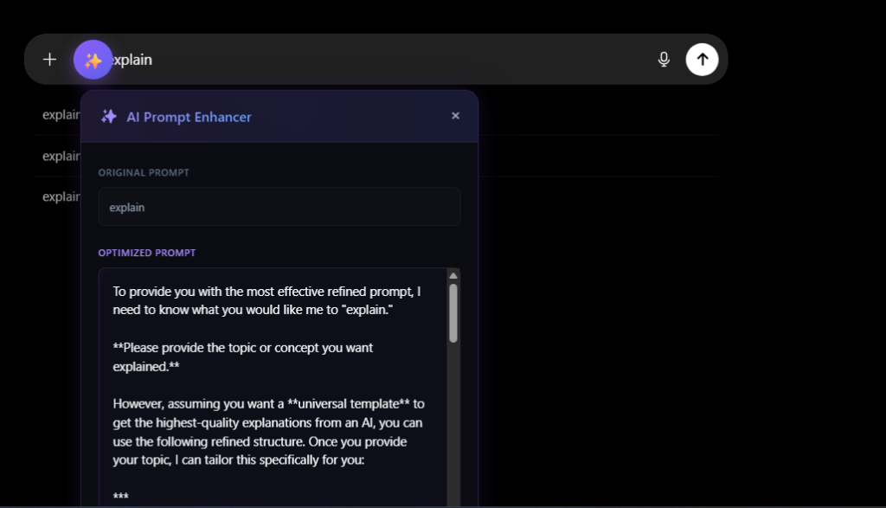
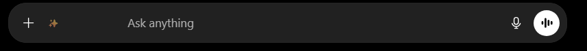
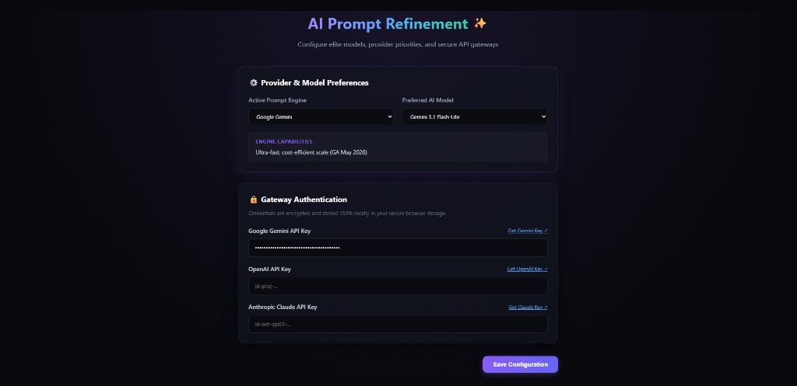

# AI Prompt Refinement Extension ✨

<p align="center">
  
</p>

<p align="center">
  <strong>Elevate your AI conversations with one-click expert prompt engineering.</strong>
</p>

<p align="center">
  
  
  
  
  
</p>

---

**AI Prompt Refinement** is an elite, high-fidelity Chrome extension designed to dynamically optimize and refine your raw, messy, or short prompts into highly detailed, structured, and contextual prompts. By injecting a seamless, glowing magic wand (✨) button directly into the chatboxes of leading LLM platforms, it helps you get significantly higher-quality answers from your favorite AI models without changing your workflow.

## 🚀 Supported Platforms

The extension features a **self-healing, zero-latency DOM-injection engine** that works perfectly on:
* 🤖 **ChatGPT** (`chat.openai.com` / `chatgpt.com`)
* 🧠 **Claude** (`claude.ai`)
* ♊ **Google Gemini** (`gemini.google.com`)
* ⚔️ **LMSYS Chatbot Arena** (`arena.ai` / `lmarena.ai` / `lmsys.org`)
* 🔮 *Plus a robust generic fallback for testing on standard textareas!*

---

## 📸 Extension Showcase

<p align="center">
  
  <br />
  <em>The high-fidelity glassmorphic overlay modal showing original vs. refined prompt comparison.</em>
</p>

<p align="center">
  
  <br />
  <em>The sleek Toolbar Popup panel containing active service statuses and the local Saved Prompts Manager.</em>
</p>

<p align="center">
  
  <br />
  <em>The Advanced Configuration Dashboard allowing users to manage providers, select active models, and secure credentials.</em>
</p>

---

## ✨ Key Features

### 1. Programmatic Wand Injection (✨)
An intelligent script listens for active focus states on chat inputs and overlays a sleek, unobtrusive magic wand (✨) button next to your chat options. It adapts instantly to both dark and light modes of the parent webpage.

### 2. Side-by-Side In-Page Previewer
When you click the ✨ button, your prompt is analyzed and optimized asynchronously. The extension pops open a stunning glassmorphic, blur-saturated comparison window inside the active webpage so you can review the improved prompt, edit it, copy it, or accept it directly into the input field.

### 3. Live Saved Prompts Library
* **Quick-Save:** Save your favorite optimized prompts directly from the in-page previewer.
* **Instant Action Popup:** Click the extension toolbar icon to view your saved prompt library. Click any prompt to copy it instantly to your clipboard, or remove entries in one click.
* **Chrome Sync Support:** All saved prompts are synced automatically across your devices under your Google Profile.

### 4. Elite Multi-Provider Integration
Configure your preferred prompt-engineering gateway in the options page. Choose between a **completely free session-based option** or any of the premium API providers:

* 🆓 **Gemini Web (Free) — No API key required:** Powered by your existing logged-in Gemini session. No billing, no setup — just sign into [gemini.google.com](https://gemini.google.com) and go. Uses Gemini's internal streaming API with your browser cookies.
* 🟢 **Google Gemini API:** `Gemini 3.5 Flash` (default), `Gemini 3.1 Pro`, `Gemini 3.1 Flash-Lite`, and legacy models.
* 🟢 **OpenAI GPT Gateway:** `GPT-5.5 Instant` (default), `GPT-5.5`, `GPT-5.3 Codex`, and legacy `GPT-4o`.
* 🟢 **Anthropic Claude Gateway:** `Claude 4.7 Opus` (default), `Claude 4.6 Sonnet`, `Claude 4.5 Haiku`.

---

---

## 🆓 Using Gemini Web (Free Mode)

The **Gemini Web** provider lets you use the extension at zero cost by piggy-backing on your active Google session — no API keys, no credit card, no monthly bills.

**How it works under the hood:**
1. When you click ✨, the background service worker fetches `gemini.google.com` with your browser cookies to extract a short-lived session token.
2. It calls Gemini's internal streaming endpoint (`StreamGenerate`) — the same one the Gemini web UI uses — passing your prompt alongside that token.
3. The streamed response is parsed and returned to the in-page previewer, just like any other provider.

**Requirements:**
* Be signed into [gemini.google.com](https://gemini.google.com) in Chrome before using the extension.
* That's it. No API key field, no model selection — just select "Gemini Web (Free)" in the options page and save.

> **Note:** This mode uses an unofficial internal API. While it works reliably today, Google may update their web interface over time. If it ever stops working, switch to the Gemini API provider as a fallback.

---

## 🔒 Security & Privacy First

We built this extension to be **100% secure, transparent, and private**:
* **Local Sandboxing:** Your API keys are encrypted and stored **100% locally** in your personal Chrome Profile (`chrome.storage.sync`). No keys, prompts, or personal telemetry are ever transmitted to or stored on third-party servers.
* **XSS Protections:** Fully built with React. No dangerous evaluations like `innerHTML` or `dangerouslySetInnerHTML` are used. Text outputs are parsed using safe React bracket expansions and plain `.textContent` DOM nodes.
* **Strict CSP Compliance:** Conforms entirely to Chrome Manifest V3 Security Guidelines—contains **zero `eval()`, zero `new Function()`, and zero dynamic remote scripts**.

---

## ⚡ Performance Engineered

* **Self-Healing DOM Scanner:** Monitors DOM swaps (common in modern SPAs during side-channel navigations) using a throttled 1-second interval. It utilizes instant early-returns to ensure **0.00% CPU overhead** when idling.
* **Zero Leakage:** Complete event hook tear-downs on unmounts prevent lingering listeners, animation frame leaks, or layout shift bottlenecks on parent sites.
* **Vite-Optimized Bundles:** Programs are fully compiled and optimized to load instantly in under 20ms.

---

## 🛠️ Local Setup & Installation

Follow these simple steps to build and run the extension locally in developer mode:

### Prerequisites
Make sure you have [Node.js](https://nodejs.org/) (v16+) and `npm` installed.

### 1. Clone the Repository
```bash
git clone https://github.com/oasissan/prompt_enhancer
cd prompt-enhancer
```

### 2. Install Dependencies
```bash
# Navigate to the extension folder
cd extension
npm install
```

### 3. Build the Extension
```bash
npm run build
```
This compiles the source code and outputs the self-contained production bundle into the `extension/dist/` directory.

### 4. Load the Extension in Chrome
1. Open Google Chrome and navigate to `chrome://extensions/`.
2. Enable **Developer mode** (toggle switch in the top-right corner).
3. Click the **Load unpacked** button in the top-left corner.
4. Select the **`extension/dist`** folder from your project directory.
5. *Voila! The extension icon will now appear in your extension toolbar!*

---

## 📂 Project Architecture

```
prompt_enhancer/
├── assets/                  # High-quality repository logo and screenshots
├── extension/
│   ├── dist/                # Production-compiled assets (Ready for loading)
│   ├── public/              # Static public resources (Manifest, icons)
│   │   ├── icons/           # Multi-scale extension branding icons
│   │   └── manifest.json    # Manifest V3 extension configuration
│   ├── src/                 # Extension source scripts
│   │   ├── assets/          # Internal React styling assets
│   │   ├── background.ts    # Service worker (API router — Gemini Web, Gemini API, OpenAI, Anthropic)
│   │   ├── content.tsx      # Injected Content Script (Shadow DOM overlays)
│   │   ├── index.css        # Global premium css design framework
│   │   ├── main.tsx         # Extension Pop-up window React dashboard
│   │   ├── options.tsx      # Extension Settings Page dashboard
│   │   ├── platformSelectors.ts # Platform DOM traversal helpers
│   │   └── storage.ts       # Secure Chrome storage synced utilities
│   ├── build.js             # Advanced multi-phase programmatic compiler
│   └── package.json         # Dependencies & scripts
└── README.md                # Root open-source documentation
```

---

## 🤝 Contributing

We welcome open-source contributions! If you have suggestions for new selectors, models, prompt-engineering rules, or design enhancements:
1. Fork the Project.
2. Create your Feature Branch (`git checkout -b feature/AmazingFeature`).
3. Commit your Changes (`git commit -m 'Add some AmazingFeature'`).
4. Push to the Branch (`git push origin feature/AmazingFeature`).
5. Open a Pull Request.

---

## 📄 License

Distributed under the MIT License. See `LICENSE` for more information.
